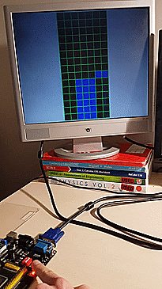

# stacker-clone-fpga

A clone of the merchandiser "STACKER" for a Cyclone IV FPGA, using a 1280 x 1024 VGA monitor as the display.

## Demo

## Getting Started
This game is supplied as an [Intel Quartus](https://www.altera.com/downloads/download-center.html) project consisting of a collection of VHDL source files and supporting IP.

## Authors

* **Marc Katzef** - [mkatzef](https://github.com/mkatzef)

## Acknowledgements

* **Toni T800** - creator of FPGA development YouTube videos including [this guide](https://www.youtube.com/watch?v=WK5FT5RD1sU).
